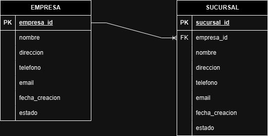
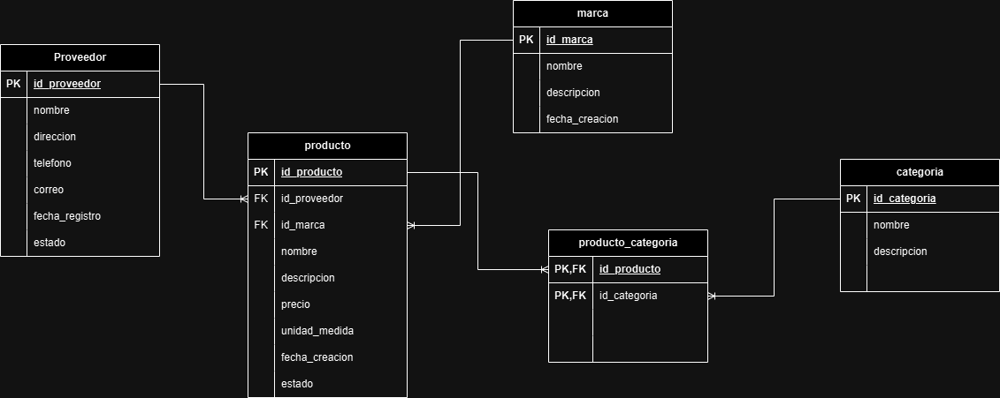
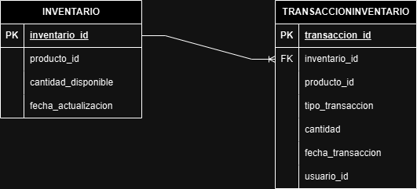

# Gestión de Usuarios con Base de Datos No Relacional

## Descripción

Una base de datos no relacional (NoSQL) es ideal para la gestión de usuarios debido a su flexibilidad y escalabilidad. Este tipo de base de datos permite almacenar datos en formatos como documentos, clave-valor, o grafos, lo que facilita la adaptación a diferentes estructuras de datos.

## Descripción de Campos Clave

- **id**: Identificador único del usuario.
- **nombre**: Nombre completo del usuario.
- **email**: Dirección de correo electrónico.
- **celular**: Número de telefono del usuario.
- **rol**: Especifica el rol del usuario en el sistema (administrador, empleado de almacen, gerente de ventas).
- **permisos**: Lista de permisos específicos asociados con el usuario, lo que permite controlar su acceso a las funcionalidades.
- **fecha_creacion**: Fecha de creación del usuario.
- **estado**: Estado actual de la cuenta del usuario (ej. activo, inactivo, suspendido).

# Gestión de Empresas con Base de Datos Relacional

## Descripción

Este modelo de base de datos está diseñado para gestionar información sobre **empresas** y sus **sucursales**. La relación entre estas dos entidades permite organizar y administrar los datos de cada empresa y sus distintas ubicaciones o puntos de operación.

## Modelo Entidad Relación 

A continuación se agrega el modelo entidad relación para la presente base de datos 

## Tablas

### Tabla `Empresa`

La tabla `Empresa` almacena información general de cada empresa registrada en el sistema. Los campos de esta tabla son:

- **empresa_id**: Identificador único de la empresa, definido como clave primaria (`PRIMARY KEY`) y con autoincremento (`AUTO_INCREMENT`).
- **nombre**: Nombre de la empresa. Es un campo obligatorio (`NOT NULL`) con un límite de 100 caracteres.
- **direccion**: Dirección de la empresa, con un límite de 200 caracteres.
- **telefono**: Número de telefono de la empresa, con un límite de 20 caracteres.
- **email**: Correo electrónico de contacto de la empresa, con un límite de 100 caracteres.
- **fecha_creacion**: Fecha en la que se creó la empresa en el sistema.
- **estado**: Estado actual de la empresa, como "activo" o "inactivo", con un límite de 50 caracteres.

### Tabla `Sucursal`

La tabla `Sucursal` almacena información sobre las distintas sucursales de cada empresa. está relacionada con la tabla `Empresa` a través de una clave foránea (`FOREIGN KEY`). Los campos de esta tabla son:

- **sucursal_id**: Identificador único de la sucursal, definido como clave primaria (`PRIMARY KEY`) y con autoincremento (`AUTO_INCREMENT`).
- **empresa_id**: Identificador de la empresa a la que pertenece la sucursal, definido como clave foránea (`FOREIGN KEY`) que referencia a `empresa_id` en la tabla `Empresa`. La relación se configura para eliminar (`ON DELETE CASCADE`) y actualizar (`ON UPDATE CASCADE`) en cascada, de modo que los cambios o eliminaciones de una empresa se reflejen en las sucursales relacionadas.
- **nombre**: Nombre de la sucursal. Es un campo obligatorio (`NOT NULL`) con un límite de 100 caracteres.
- **direccion**: Dirección de la sucursal, con un límite de 200 caracteres.
- **telefono**: Número de telefono de la sucursal, con un límite de 20 caracteres.
- **email**: Correo electrónico de contacto de la sucursal, con un límite de 100 caracteres.
- **fecha_creacion**: Fecha en la que se creó la sucursal en el sistema.
- **estado**: Estado actual de la sucursal, como "activo" o "inactivo", con un límite de 50 caracteres.

## Relaciones entre Tablas

La relación entre `Empresa` y `Sucursal` es de uno a muchos, donde una **empresa** puede tener múltiples **sucursales**, pero cada **sucursal** está asociada a una única **empresa**. La configuración en cascada para eliminar y actualizar en la relación entre `Sucursal` y `Empresa` garantiza que cualquier cambio en la entidad `Empresa` afecte automáticamente a las sucursales correspondientes, manteniendo la integridad referencial.

Este modelo permite gestionar los datos de empresas y sus sucursales de forma estructurada, facilitando las operaciones de consulta y administración en sistemas de bases de datos relacionales.

# Gestión de Productos Proveedores con Base de Datos Relacional

## Descripción

Este modelo de base de datos está diseñado para gestionar la información sobre **proveedores**, **marcas**, **productos** y sus **categorías** en un sistema de inventario o gestión de productos. A continuación, se detalla cada una de las tablas y sus relaciones.

## Modelo Entidad Relación 

A continuación se agrega el modelo entidad relación para la presente base de datos 

## Tablas

### Tabla `Proveedor`

La tabla `Proveedor` almacena la información de los proveedores de productos. Los campos de esta tabla son:

- **id_proveedor**: Identificador único del proveedor, definido como clave primaria (`PRIMARY KEY`) con autoincremento (`AUTO_INCREMENT`).
- **nombre**: Nombre del proveedor, campo obligatorio (`NOT NULL`) con un límite de 100 caracteres.
- **direccion**: Dirección del proveedor, con un límite de 255 caracteres.
- **telefono**: Número de telefono del proveedor, con un límite de 15 caracteres.
- **correo_electronico**: Correo electrónico de contacto del proveedor, con un límite de 100 caracteres.
- **fecha_registro**: Fecha en la que el proveedor fue registrado, campo obligatorio.
- **estado**: Estado del proveedor, definido como un tipo enumerado (`ENUM`) que puede ser 'activo' o 'inactivo', con 'activo' como valor predeterminado.

### Tabla `Marca`

La tabla `Marca` almacena las marcas de los productos. Los campos de esta tabla son:

- **id_marca**: Identificador único de la marca, definido como clave primaria (`PRIMARY KEY`) con autoincremento (`AUTO_INCREMENT`).
- **nombre**: Nombre de la marca, campo obligatorio (`NOT NULL`) con un límite de 100 caracteres.
- **descripcion**: Descripción de la marca, campo opcional de tipo `TEXT`.

### Tabla `Producto`

La tabla `Producto` almacena información detallada de los productos ofrecidos. está relacionada con las tablas `Proveedor` y `Marca` a través de claves foráneas (`FOREIGN KEY`). Los campos de esta tabla son:

- **id_producto**: Identificador único del producto, definido como clave primaria (`PRIMARY KEY`) con autoincremento (`AUTO_INCREMENT`).
- **id_proveedor**: Identificador del proveedor del producto, definido como clave foránea que referencia `id_proveedor` en la tabla `Proveedor`. En caso de eliminación del proveedor, este campo se establece en `NULL` (`ON DELETE SET NULL`).
- **id_marca**: Identificador de la marca del producto, definido como clave foránea que referencia `id_marca` en la tabla `Marca`. En caso de eliminación de la marca, este campo se establece en `NULL` (`ON DELETE SET NULL`).
- **nombre**: Nombre del producto, campo obligatorio (`NOT NULL`) con un límite de 100 caracteres.
- **descripcion**: Descripción del producto, campo opcional de tipo `TEXT`.
- **precio**: Precio del producto, campo obligatorio con dos decimales (`DECIMAL(10, 2)`).
- **unidad_medida**: Unidad de medida del producto (por ejemplo, piezas, litros), con un límite de 50 caracteres.
- **fecha_creacion**: Fecha en la que el producto fue creado en el sistema, campo obligatorio.
- **estado**: Estado del producto, definido como un tipo enumerado (`ENUM`) que puede ser 'disponible' o 'no disponible', con 'disponible' como valor predeterminado.

### Tabla `Categoria`

La tabla `Categoria` almacena las categorías de productos. Los campos de esta tabla son:

- **id_categoria**: Identificador único de la categoría, definido como clave primaria (`PRIMARY KEY`) con autoincremento (`AUTO_INCREMENT`).
- **nombre**: Nombre de la categoría, campo obligatorio (`NOT NULL`) con un límite de 100 caracteres.
- **descripcion**: Descripción de la categoría, campo opcional de tipo `TEXT`.

### Tabla `Producto_Categoria`

La tabla `Producto_Categoria` es una tabla de asociación que permite una relación de muchos a muchos entre `Producto` y `Categoria`. Los campos de esta tabla son:

- **id_producto**: Identificador del producto, definido como clave foránea (`FOREIGN KEY`) que referencia `id_producto` en la tabla `Producto`.
- **id_categoria**: Identificador de la categoría, definido como clave foránea (`FOREIGN KEY`) que referencia `id_categoria` en la tabla `Categoria`.
- **PRIMARY KEY (id_producto, id_categoria)**: Clave primaria compuesta que asegura la unicidad de las combinaciones de productos y categorías, evitando duplicados en la asociación.

# Gestión de inventarios con Base de Datos Relacional

## Descripción

Este modelo de base de datos está diseñado para gestionar el inventario de productos y sus transacciones (entradas y salidas). Además, incluye un **trigger** que actualiza automáticamente la cantidad disponible en el inventario después de cada transacción de entrada o salida.

## Modelo Entidad Relación 

A continuación se agrega el modelo entidad relación para la presente base de datos 

## Tablas

### Tabla `inventario`

La tabla `inventario` registra la cantidad disponible de cada producto y la última fecha de actualización. Los campos de esta tabla son:

- **inventario_id**: Identificador único del registro de inventario, definido como clave primaria (`PRIMARY KEY`) con autoincremento (`AUTO_INCREMENT`).
- **producto_id**: Identificador del producto en inventario, que se relaciona con el producto correspondiente.
- **cantidad_disponible**: Cantidad disponible del producto en inventario, campo obligatorio (`NOT NULL`).
- **fecha_actualizacion**: Fecha y hora de la última actualización del inventario. Se establece automáticamente en la fecha actual y se actualiza cada vez que se modifica la cantidad disponible (`ON UPDATE CURRENT_TIMESTAMP`).

### Tabla `transaccioninventario`

La tabla `transaccioninventario` almacena todas las transacciones relacionadas con el inventario, ya sean de entrada (aumentan la cantidad disponible) o de salida (disminuyen la cantidad disponible). Los campos de esta tabla son:

- **transaccion_id**: Identificador único de la transacción, definido como clave primaria (`PRIMARY KEY`) con autoincremento (`AUTO_INCREMENT`).
- **inventario_id**: Identificador del registro de inventario al que pertenece la transacción. Es una clave foránea (`FOREIGN KEY`) que referencia `inventario_id` en la tabla `inventario`.
- **producto_id**: Identificador del producto involucrado en la transacción.
- **tipo_transaccion**: Tipo de transacción, definido como un tipo enumerado (`ENUM`) que puede ser 'entrada' o 'salida'.
- **cantidad**: Cantidad de producto involucrada en la transacción, campo obligatorio (`NOT NULL`).
- **fecha_transaccion**: Fecha y hora en la que se realiza la transacción. Se establece automáticamente en la fecha actual.
- **usuario_id**: Identificador del usuario que realiza la transacción.

## Trigger `actualizar_inventario`

El **trigger** `actualizar_inventario` se activa automáticamente después de cada inserción en la tabla `transaccioninventario`. Su función es actualizar la cantidad disponible en la tabla `inventario` en función del tipo de transacción. La lógica del trigger es la siguiente:

1. **Verificar Existencia del Inventario**: Comprueba si existe un registro de inventario para el producto correspondiente.
   
2. **Transacción de Entrada o Salida**:
   - Si el tipo de transacción es 'entrada', el trigger suma la cantidad especificada al inventario existente.
   - Si el tipo de transacción es 'salida', resta la cantidad especificada del inventario.

3. **Crear Registro de Inventario si No Existe**:
   - Si el inventario no existe y la transacción es de tipo 'entrada', crea un nuevo registro en la tabla `inventario` con la cantidad ingresada y la fecha actual.

Este modelo asegura la actualización automática de las cantidades en inventario y facilita la trazabilidad de todas las transacciones de productos, permitiendo un control preciso del inventario.